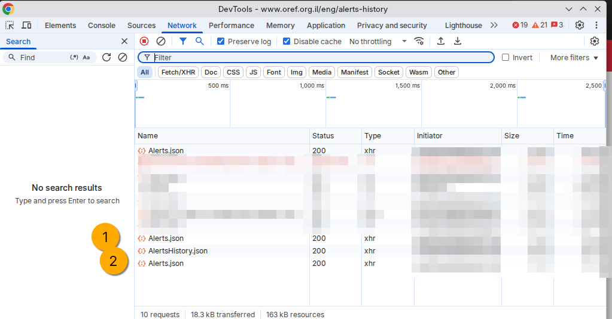
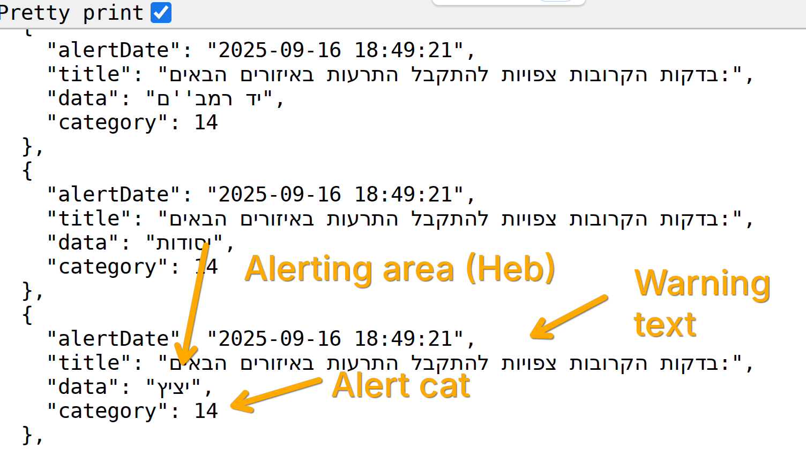

# Israel Home Front Command Red Alerts - JSON Syntax Information

## Disclaimer

These notes were written on September 16, 2025. No warranty is offered as to their accuracy - neither at this date nor at any future date. 

Alerting apps that sit "downstream" of the `JSON` endpoints pollable at [Oref.org.il](https://oref.org.il) are, by their very definition, non-official sources. 

The payload delivered through these endpoints changes somewhat frequently. Therefore, ongoing "attention" is advised to validate that the payloads fit the expected structure being scripted for.

Common sense and my strongest recommendation also dictates that to the extent that their false positive rate fits within acceptable margins, non-official alerting systems should always be used as an *additional* alerting systems. If you live in Israel and your personal safety depends upon the timely receipt of alerts, please use the various Home Front Command operated systems in the first instanec. 

## Intended Usage

I have used, with gratitude, the excellent [Oref Alert](https://github.com/amitfin/oref_alert) Home Assistant integration (maintainer: [Amit Finkelstein](https://github.com/amitfin)).

Despite the fact that I live in Israel - and in an area in which the "real" red alerts are very audible - integrating the Pikud HaOref feed into my smart home (and life) has proven highly valuable. 

During the Iran-Israel War, for example, the Home Assistant integration reliably drove on lights and sirens in the middle of the night, helping me get to shelter groggy but safe.

When sheltering from missiles, these advantages are significant and potentially life-saving.

## Information Security / InfoSec: Considerations

I write the above for the following reason:

While the Pikud HaOref JSON-serving endpoints are georestrictited, their URLs are trivially easy to identify through simple inspection of network traffic on the frontend:

Furthermore: 

Running ["exact match" searches](https://www.google.com/search?q=%22https%3A%2F%2Fwww.oref.org.il%2FwarningMessages%2Falert%2FHistory%2FAlertsHistory.json%22&oq=%22https%3A%2F%2Fwww.oref.org.il%2FwarningMessages%2Falert%2FHistory%2FAlertsHistory.json%22&gs_lcrp=EgZjaHJvbWUyBggAEEUYOdIBBzc5MWowajeoAgCwAgA&sourceid=chrome&ie=UTF-8) on the alert history endpoint, for example, shows that they have been discussed on websites ranging from Reddit to Facebook - and aggregated into Github repositories. 

To the extent that the red alerts may provide useful open source intelligence to adversaries of Israel, I point out the following (note: when providing code samples like these before, I have provided the URLs as environment variables/secrets):

- The existence of a plurality of non-georestricted syndication sources defeats the purpose of georestriction. Given that any of these sources can be scraped with bots, it is hard to envisage a situation in which those intent on leveraging these for hostile purposes could not construct their own real time (or near real time) mirrors 
- It is to be assumed that nation state actors, including the IRGC, have basic tech skills in proxying etc and are able to circumvent basic geofencing restrictions and that the IDF assumes that any information provided to millions of citizens can be easily exfiltrated 

These notes are shared precisely because I believe that the potential good that may arise from open source users scripting their own automations (in addition to official ones) outweights any potential negatives.

## Alerting Endpoints

| Description     | URL                                                                                          | Format |
|-----------------|----------------------------------------------------------------------------------------------|--------|
| Alert History   | [AlertsHistory.json](https://www.oref.org.il/warningMessages/alert/History/AlertsHistory.json) |  |
| Active Alerts   | [Alerts.json](https://www.oref.org.il/warningMessages/alert/Alerts.json)                       |  |

## Alerting Cadence

The frequency with which the Houthi militant group has been firing rockets at Israeli civilian areas prompted the IDF (in early 2025) to introduce "early warning" alerts. 

These alerts are intended to provide the population with a few minutes of additional warning to make it to safe shelter. 

During the Iran Israel War of 2025 (the 'Twelve Day War') the IDF began issuing a new type of informational alert which is equivalent, roughly to an all clear. 

While the IDF alerts are translated into French, English, Russian, and Arabic, only the Hebrew should be considered authoritative for configuring text-based alert filtering. 

## Parsing: Emergency Event Codes/Classification

The following table shows the three distinct alert statuses found in the JSON data, with their Hebrew titles, corresponding categories, and English translations:

| Hebrew Title | Category | Common Name | English Translation |
|--------------|----------|-------------|-------------------|
| `ירי רקטות וטילים` | 1 | Active Red Alert | Rocket and missile fire |
| `ירי רקטות וטילים - האירוע הסתיים` | 13 | Event Ended / All Clear | Rocket and missile fire - the event has ended |
| `בדקות הקרובות צפויות להתקבל התרעות באיזורים הבאים:` | 14 | Prewarning | In the coming minutes, alerts are expected to be received in the following areas: |

## Worked Example: Houthi Missile Attack, September 16th 2025

`History-cadence.json` provides an alert cadence captured during a Houthi missile attack on September 16th 2025 and is chosen as a reference payload because it exhits the typical "cadence" in alerting:

- At 18:49:21 IST on September 16th 2025 (15:49 UTC), the IDF issued a widespread "pre-warning" to 419 alerting areas in Israel providing advance notice of an incoming missile from Yemen. 
- At 18:51:30 IST (15:51 UTC) the IDF issued an active red alert to 220 alerting areas (53% of source total). The active alert was issued **2 minutes and 9 seconds** after the warning (this fact is provided to emphasise that the pre-warnings should not be treated as "casual" advance notice messages but rather instructions to get to safe shelter now.)
- At 19:01;31 the IDF issued an "the event has ended" message, 10 minutes after the red alert warning. 

The all clear message is *generally* received 10 minutes after the active warning (when the danger of injury from interceptor shrapnel has passed). But it would be a mistake to take this as a certitude or automate around this fact: during instances of repeat barrage (as happened in the Twelve Day War) the "all clear" may not issue until both an active barrage has ended and no further ones are known to be on the way. 

---

# Automation Matching

If you wish to leverage this `JSON` data to drive alerting automations for a static location such as your home or office, you can use this approach:

- Know your alerting area. This is the Hebrew text of your alerting zone and will be used for exact string matches. 
- Automate around the `JSON` payload and matches for your locality with the three tags. While rocket alerts are event type '1' your system may wish to encompass the other forms of threat for which there are fixed classifications, like terrorist infiltrations and hostile UAV detection. 

---

# Worked Example: Python Script For Providing MQTT Events For Alert Types For A Monitored Zone (Jerusalem Center)

A model Python script is provided to illustrate the approach. But in automation terms, the chain can be virtually limitless. If you use Home Assistant you can save yourself the polling work and write a Home Assistant automation to drive MQTT events and REST requests. 

Example use-cases:

- Real time information analysis: check social media X seconds after alert, provide short brief as to who's firing etc (leveraging AI, works nicely)  
- Get to shelter: WHEN alert is triggered, find nearest shelter based on my geolocation (requires shelter data)  
- Desktop notifier: pop up alerts when a red alert event is detected  